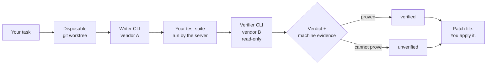

<div align="center">

# Bom Orchestration

### Two AI CLIs. One writes. The other has to prove it.

[](https://github.com/bomtobe-hgkim/bom-orch-marketplace/releases)
[](./LICENSE)
[](https://nodejs.org)
[](#how-to-start)

</div>

---

## What it is

Bom Orchestration is a local MCP server. It installs as a plugin into **Claude Code**
and **Codex**, and behaves the same in both. It delegates your task to one vendor's CLI
inside a disposable git worktree, runs your repository's **own** test suite itself, hands
the result to a **different vendor** for read-only review, and grades the outcome on
machine evidence instead of prose.



## Why it is different

Most AI coding tools hand you a diff and a confident summary. You still have to
find out for yourself whether it works.

The writer never grades its own work, and the verifier never gets write access.
The test run belongs to the server, not to either model — so "the tests pass" is
something we observed, not something a model told us. When it cannot prove the
change works, it says `unverified` and tells you why.

## What it costs

There is no subscription to buy here: a run spends only what your existing `claude`
and `codex` logins already spend. By default it spends **both**, not one — the vendor
that writes and the vendor that reviews are different by construction, unless you
explicitly allow a one-vendor run. The third cost is time rather than credit, because
this server runs your own test suite between the two.

Two arguments bound it before you call — `budget` caps how many attempts a lane may
take, and `wait_ms` caps the wall clock for the whole run. Two result fields report
it afterwards: `preflight` says what the run was expected to need **before** any
credit was spent, and `cost` says what it actually took — elapsed time, per-vendor
calls and tokens, and how many times your suite ran.

Two things make a cheap-looking call expensive: a second candidate lane, and a run
that has to prove a regression. Both are spelled out with their real arithmetic in
the first rows of [What it will not do](#what-it-will-not-do).

## When not to use it

- **A repository you would not run unreviewed code inside.** This server executes
  worker-authored code and your repository's own test scripts on your machine, with
  your privileges.
- **A repository with no test command.** The run still returns a patch, but the grade
  stops at `unverified` — there is no machine evidence with which to raise it.
- **A task you expect to land in your working tree.** Every run ends at a patch file
  on disk; writing it into your repository is a separate call you make yourself.
- **A host that reaches its vendor through Bedrock or Vertex.** Those deployments are
  refused before any vendor process starts, with a reason code and no credit spent.

> **This release ships thirteen limits, and they are the point of the tool rather than a footnote.** Eleven of them are in [What it will not do](#what-it-will-not-do); the remaining two are [what test evidence each ecosystem yields](#what-test-evidence-each-ecosystem-yields) and [where your data goes](#where-your-data-goes), because each of those facts is only useful next to the section it constrains. Read them before you install.

## How to start

Installing takes at most three commands. Read the table first anyway: which test
runner your repository uses is what decides how far a run can get, and that is
easier to know now than after the first `unverified`.

### What test evidence each ecosystem yields

`verified` needs machine evidence this server can read from your own test run. Where a row says
witness-capable, that evidence also says which test covered which changed file — what a run that
needs regression proof must show, and that is the default for code work unless the task reads as
a feature, refactor, or docs change. Where it says parsed only, the evidence is the outcome and
nothing more, but it is still cross-checked against your test command's exit code: a runner that
exits 0 while its own report says failures is caught, and the run is credited with no outcome
rather than a pass.

| Ecosystem | Evidence adapter | What `verified` needs |
|---|---|---|
| node:test | `node-events-v1` | Witness-capable. Ordinary work and a run that needs regression proof can both reach `verified`. (1) |
| pytest | `pytest-events-v1` | Witness-capable. Ordinary work and a run that needs regression proof can both reach `verified`. (2) |
| .NET | `dotnet-trx-v1` | Parsed only — the outcome, no witnesses. A run that needs regression proof cannot prove it and stops at `unverified`. |
| Vitest | `junit-xml-v1` | Witness-capable (grade A). Witnesses are recorded, but regression proof is not granted on them in this release, so a run that needs regression proof stops at `unverified`. (3) |
| Jest | `junit-xml-v1` | Witness-capable (grade B) only when jest-junit writes a `file` attribute (`addFileAttribute`); without it, parsed only. Witnesses are recorded, but regression proof is not granted on them in this release, so a run that needs regression proof stops at `unverified`. (3) |
| Gradle, Maven, Go (gotestsum), Rust (cargo-nextest) | `junit-xml-v1` | Parsed only — the outcome, no witnesses. A run that needs regression proof cannot prove it and stops at `unverified`. (3) (4) |

(1) node:test earns `node-events-v1` only when the test command in `package.json`'s `scripts.test`
is a literal `node …` invocation. A wrapper such as `c8 node --test` gets no adapter, and that run
is the case the paragraph below this table describes.

(2) pytest keeps its witnesses only when `testpaths` is absent, or is a list of entries this server
can parse. A `testpaths` that repeats an entry, contains an empty one, or cannot be parsed leaves
the adapter in place but trusts no witness, which makes the run parsed only.

(3) **The four `junit-xml-v1` rows are opt-in, not automatic.** Automatic selection knows exactly
three adapters — `node-events-v1`, `pytest-events-v1` and `dotnet-trx-v1`. A run reaches
`junit-xml-v1` only when a committed `.bom-orch.json` declares `tests.reporter: "junit-xml"`,
and the schema then also requires `tests.resultsPath`: the file or directory your runner writes
its XML to, relative to the repository root of the worktree (not to `tests.cwd`). Without that
file a Vitest or Jest repository runs at no adapter at all — exit code and output only.

(4) Gradle, Maven, Go and Rust additionally need `tests.command` in the same file. Command
derivation reads five things and nothing else: `.bom-orch.json`'s `tests.command`,
`package.json`'s `scripts.test`, a single root `*.csproj`, a `Makefile` `test` target, and
`pytest.ini` / `pyproject.toml`. None of those name a Gradle, Maven, `go test` or
`cargo nextest` invocation.

Outside these rows this server selects no adapter automatically — any runner that writes JUnit XML
can still opt in with `tests.reporter` — the same opt-in note (3) names, not a second
mechanism — and everything else is judged on the exit code and full output alone. That is enough that ordinary work can still reach `verified`, but nothing tells this
server which test covered which file, so a run that needs regression proof stops at `unverified`.

### Prerequisites

- Node.js 22.11 or newer
- `claude`, `codex`, and `git` on the host application's `PATH`
- Both worker CLIs authenticated before the first `orch_run`
- A subscription or keychain login, not a gateway deployment: a shell that turns on
  `CLAUDE_CODE_USE_BEDROCK` or `CLAUDE_CODE_USE_VERTEX` has its runs refused
  before anything starts; an explicit `0`/`false`/`no`/`off` is not "on" (see
  *Where your data goes*)

### Claude Code

```powershell
$env:CLAUDE_CODE_PLUGIN_PREFER_HTTPS = '1'
claude plugin marketplace add bomtobe-hgkim/bom-orch-marketplace
claude plugin install bom-orch@bom-orch-marketplace
```

Claude's GitHub shorthand otherwise prefers SSH. That environment setting forces
HTTPS for users who do not have GitHub SSH keys. In Bash or Zsh:

```bash
CLAUDE_CODE_PLUGIN_PREFER_HTTPS=1 claude plugin marketplace add bomtobe-hgkim/bom-orch-marketplace
claude plugin install bom-orch@bom-orch-marketplace
```

### Codex

```powershell
codex plugin marketplace add bomtobe-hgkim/bom-orch-marketplace
codex plugin add bom-orch@bom-orch-marketplace
```

### Confirm it loaded

Open a new host session and check that all eight `orch_*` tools are present, then
call `orch_models`. Neither step spends model tokens. If nothing appeared at all,
start from [Troubleshooting](#troubleshooting).

### First upgrade from 0.2.2

Version 0.2.2 predates the shared-state schema and fencing in this release. To keep one
`BOM_ORCH_HOME`, stop both Claude and Codex hosts, upgrade both, and only then restart them.
Do not restart or roll back a 0.2.2 host after either upgraded host has published the new schema.
Version-skew safety begins between schema-aware releases; an older schema-aware host falls back
to read-only access when it sees a newer schema.
Both host applications must run on the same machine and `BOM_ORCH_HOME` must be on its local
filesystem. Do not put it on a network share or use one state root from different machines;
remote process identity and distributed-filesystem locking are not supported.

<details>
<summary><b>Pin a version, verify, upgrade, or remove</b></summary>

Pin a released tag instead of tracking `main`:

```powershell
claude plugin marketplace add bomtobe-hgkim/bom-orch-marketplace@v1.0.0 --scope user
codex plugin marketplace add bomtobe-hgkim/bom-orch-marketplace --ref v1.0.0
```

Claude Code:

```powershell
claude plugin marketplace list --json
claude plugin list --json
claude plugin details bom-orch@bom-orch-marketplace
claude mcp get plugin:bom-orch:bom-orch
claude plugin marketplace update bom-orch-marketplace
claude plugin update bom-orch@bom-orch-marketplace --scope user
claude plugin uninstall bom-orch@bom-orch-marketplace --scope user
claude plugin marketplace remove bom-orch-marketplace --scope user
```

Codex:

```powershell
codex plugin marketplace list --json
codex plugin list --json
codex mcp list --json
codex plugin marketplace upgrade bom-orch-marketplace --json
codex plugin add bom-orch@bom-orch-marketplace --json
codex plugin remove bom-orch@bom-orch-marketplace --json
codex plugin marketplace remove bom-orch-marketplace --json
```

Automation that may already configure `CLAUDE_CODE_PLUGIN_PREFER_HTTPS` should
preserve the existing value — use
`if (-not $env:CLAUDE_CODE_PLUGIN_PREFER_HTTPS) { $env:CLAUDE_CODE_PLUGIN_PREFER_HTTPS = '1' }`
in PowerShell or `: "${CLAUDE_CODE_PLUGIN_PREFER_HTTPS:=1}"` in Bash/Zsh.

</details>

## Your first run

```jsonc
// 1. Who is installed, and which models can they use?
orch_models  { "refresh": true }

// 2. Optional: pin the model and effort behind each abstract tier.
orch_config  { "vendor": "claude", "tier": "strong", "model": "opus" }

// 3. Delegate. `project` must be an absolute path to a git repository —
//    an MCP stdio server inherits its working directory from the host,
//    so a relative path lands somewhere you did not intend.
orch_run     { "task": "…what to change, concretely…",
               "project": "C:\\path\\to\\repo",
               "budget": 5 }

// 4. Read the patch, then apply it yourself:  git apply <patch.path>

// 5. Optional: correct the automatic grade so the next run learns from it.
orch_stats   { "runs": 20 }
// No run_id, because the orch_run call above was cut off? List what is on disk,
// then read that run back with orch_status { "run_id": "…" }.
orch_status  {}
orch_reward  { "run_id": "…", "good": false, "note": "tests passed, requirement missed" }
// Destructive and separate from the read-only statistics call:
orch_reset   { "confirm": true, "task_class": "code:test-bearing" }
```

## What a result looks like

`orch_run` answers with an envelope. The one below is not an illustration: it is a
golden fixture checked into this repository, and a packaging test holds both blocks
equal to it, so a change in what the server emits turns that test red instead of
leaving this page describing a shape that no longer exists.

The envelope is the wrapper your host receives. `serverVersion` and `upgradeCommands`
ride on every envelope and are the only two fields left out here:

```json
{
  "status": "succeeded",
  "content": "{\"runId\":\"run-golden\",\"stopReason\":\"verified\",\"reasonCode\":\"lane_verified\",\"stepCount\":10,\"baseline\":{\"commit\":\"bbbbbbbbbbbbbbbbbbbbbbbbbbbbbbbbbbbbbbbb\",\"tree\":\"cccccccccccccccccccccccccccccccccccccccc\",\"dirty\":true,\"dirtyFiles\":[\"docs/notes.md\",\"src/lane-a/000-changed-module.mjs\"]},\"patch\":{\"path\":\"/golden/state/patches/run-golden.patch\"},\"scope\":{\"flagged\":false,\"hardViolation\":false,\"allowlisted\":false,\"reasonCount\":2,\"omittedReasonCount\":0},\"worktree\":{\"transplanted\":true,\"ignoredPathCount\":16,\"sharedRuleCount\":0,\"cleanup\":{\"removed\":true,\"unregistered\":true,\"tracked\":false}},\"blockers\":[],\"learning\":null,\"plan\":{\"provider\":\"claude\",\"content\":null,\"source\":\"model\"},\"steps\":[],\"verdict\":{\"candidateId\":\"lane-a\",\"attemptId\":\"run-golden/lane-a/010\",\"verdict\":\"PASS\"},\"issues\":[{\"candidateId\":\"lane-a\",\"openIssueIds\":[],\"openIssueCount\":0,\"resolvedOmittedCount\":0}],\"candidates\":[{\"candidateId\":\"lane-a\",\"patch\":{\"path\":\"/golden/state/runs/run-golden/candidates/lane-a.patch\"},\"proofStatus\":\"proved\",\"openIssueIds\":[],\"openIssueCount\":0}],\"attempts\":[],\"regressionProof\":{\"status\":\"proved\",\"selectedCandidateId\":\"lane-a\",\"evidenceRefs\":[],\"omittedEvidenceCount\":0},\"selection\":{\"outcome\":\"winner\",\"selectedCandidateId\":\"lane-a\"},\"artifacts\":{\"manifestPath\":\"/golden/state/runs/run-golden/manifest.json\",\"candidatePaths\":[\"/golden/state/runs/run-golden/candidates/lane-a.patch\"],\"omittedCount\":0},\"cost\":{\"elapsedMs\":1234567,\"providers\":{\"claude\":{\"calls\":12,\"promptTokens\":1234567,\"evalTokens\":1234567},\"codex\":{\"calls\":9,\"promptTokens\":1234567,\"evalTokens\":1234567}},\"testRuns\":{\"count\":6,\"totalMs\":1098765}},\"omittedCounts\":{\"issues\":0,\"attempts\":10,\"evidence\":0,\"files\":22,\"artifacts\":0,\"scopeReasons\":2,\"blockers\":1,\"planChars\":66},\"reduced\":\"floor\"}",
  "confidence": "verified",
  "runId": "run-golden",
  "stopReason": "verified",
  "log": { "path": "/golden/state/logs/run-golden.jsonl" }
}
```

`content` carries the body as a JSON string, because an MCP tool result is text.
Parsed, and abridged here to 9 of its 22 top-level keys, the same run reads:

```json
{
  "runId": "run-golden",
  "stopReason": "verified",
  "reasonCode": "lane_verified",
  "patch": { "path": "/golden/state/patches/run-golden.patch" },
  "verdict": { "candidateId": "lane-a", "attemptId": "run-golden/lane-a/010", "verdict": "PASS" },
  "regressionProof": { "status": "proved", "selectedCandidateId": "lane-a", "evidenceRefs": [], "omittedEvidenceCount": 0 },
  "selection": { "outcome": "winner", "selectedCandidateId": "lane-a" },
  "cost": {
    "elapsedMs": 1234567,
    "providers": {
      "claude": { "calls": 12, "promptTokens": 1234567, "evalTokens": 1234567 },
      "codex": { "calls": 9, "promptTokens": 1234567, "evalTokens": 1234567 }
    },
    "testRuns": { "count": 6, "totalMs": 1098765 }
  },
  "reduced": "floor"
}
```

`reduced` names how far the body was cut to fit the host's response budget — `floor`
is the last rung, what a run still tells you when nothing else fits. Nothing above is
a model's prose: `verdict` is the verifier's structured judgement, `regressionProof`
is what the server's own test runs showed, and `cost` is measured, not estimated. The
complete field list, every rung, and the closed vocabulary behind `stopReason` and
`reasonCode` ship with the plugin as skills and as `REASON_CODES.md`.

## The eight tools

| Tool | What it does |
|---|---|
| `orch_run` | Delegates a task, cross-checks it with the other vendor, returns a patch file and a structured outcome |
| `orch_models` | Lists installed vendors, versions, and available model choices |
| `orch_config` | Reads or updates the model and effort behind each tier |
| `orch_stats` | Read-only learning statistics: a compact summary by default, raw alpha/beta with `view:full`, plus optional recent runs |
| `orch_status` | Reads one finished run back off disk, or lists the recent runs when called with no arguments |
| `orch_apply` | Applies a finished run's patch to your repository — the explicit step `orch_run` never takes on its own |
| `orch_reward` | Human correction of a past run's automatic grade. Idempotent |
| `orch_reset` | Clears learned posteriors only when called with `confirm:true`; optionally narrowed by task class |

Full argument tables and the complete result contract ship with the plugin as
skills, which both hosts read.

## What it will not do

Eleven of this release's thirteen limits are here. The other two stay where they are
useful rather than being copied into this table: [what test evidence each ecosystem
yields](#what-test-evidence-each-ecosystem-yields) decides whether a repository can
reach `verified` at all, and [where your data goes](#where-your-data-goes) carries the
retention policy. The one-line pointer to all thirteen is above the install commands,
where somebody still deciding whether to install can see it.

| | |
|---|---|
| **Structured verifier, not prose** | The verifier returns structured JSON checks and issues. Callers that treated a prose approval as a pass need to be updated. |
| **`candidates: 2` roughly doubles cost** | Two lanes each author, each cross-verify, and each run their own regression evidence. Provider, writer, and test calls all roughly double. |
| **Regression proof multiplies the test runs** | A run that must prove a regression runs your whole test suite up to six times in series per candidate per attempt, against two for a run that needs no proof — the candidate twice, the baseline twice, and the baseline carrying that lane's new tests twice. Only the two plain baseline runs are shared across the whole run, because the evidence cache keys them by the baseline tree and the frozen test plan alone; the other four are that lane's own, and the candidate pair is never cached at all, so it runs again on every attempt. Six is therefore the ceiling for one candidate and one attempt: at the default `budget: 5` the run's ceiling is 22 serial suite runs, and 42 with `candidates: 2`. `cost.testRuns` reports what it actually took, and preflight warns before any credit is spent when those runs cannot fit inside `wait_ms`. |
| **One shared deadline** | `wait_ms` bounds the whole run, not each lane. It is one shared deadline; after it passes, no new provider, test, or judge call starts. |
| **A `tie` has no patch** | When the judges disagree, both candidate patches stay on disk as recoverable artifacts and there is no representative patch. Read both and choose yourself. |
| **Untrusted tests cap the grade** | If no test command was found, the result stops at `unverified`. A runner whose evidence cannot say which test covers which changed file does not stop ordinary work from reaching `verified` — but a run that needs regression proof (a bug fix that has to show the failure reproduced) stops at `unverified`. |
| **Long paths block early** | A state root deep enough to overflow the response budget ends as `blocked` before any worktree is created. Point `BOM_ORCH_HOME` at a shorter directory and call again. |
| **Patches are not applied automatically** | The result is a patch file path. You read it, then you apply it — with `git apply`, or by calling `orch_apply` with that run's `run_id`, which is the only call here that writes outside this server's own state directory. |
| **The run baseline and apply-time HEAD are separate facts** | A clean start may reuse the starting HEAD. When uncommitted work is transplanted, the baseline instead becomes a server-created synthetic snapshot that contains it. An explicit `orch_apply` first checks the target working tree as it stands; only when direct application does not fit may it use that baseline for a verified three-way onto the target's current committed HEAD. A full apply report distinguishes `baseline`, `head`, and `repository.dirty`. Apply-time scope approval comes only from `scope.allow` in the `.bom-orch.json` committed at that HEAD; the earlier call's `scope_allow` is not retained. If the final pre-write recheck sees a HEAD move, it returns `apply_head_moved` without applying anything; that check and `git apply` are separate processes, so avoid concurrent repository changes. Follow the failure envelope's top-level `recovery` for the next safe action. |
| **A worktree is not a sandbox** | The disposable worktree is not an OS sandbox. Worker-authored code and your repository's own test scripts run with your user privileges. Do not point this at a repository you do not trust. |
| **Dependency provisioning is opt-in** | `tests.provisionDeps` in `.bom-orch.json` turns it on. When on, the run performs the baseline lockfile install with lifecycle scripts disabled inside the worktree and keeps its cache under the state root — it still executes your package manager and downloads from your registry. |

## It learns, and it shows its work

Every run records which decisions it made — which vendor wrote, which verified,
which tier ran — and whether the outcome held up under machine evidence. A
Bayesian bandit uses that history to pick the next run's strategy.

**The history is one store, not one per project.** Runs are bucketed by task
class — a code change in a repository that has a usable test command lands in a
different bucket from one that does not — and those buckets live in a single
`.bom-orch` directory under your profile, shared by every repository you point
`orch_run` at and by both hosts. That is the design: a strategy that works for
test-bearing code is not a fact about one checkout. Set `BOM_ORCH_HOME` to a
per-project absolute path if you would rather keep them apart.

It is deliberately conservative about what counts as evidence:

- **Success** counts only when the selected candidate is `verified`.
- **Failure** counts only on trustworthy machine evidence or an explicit policy violation.
- **Everything else abstains.** A verifier-only failure, a flaky runner, a tie, a
  deadline, or a provider outage changes nothing.

`orch_stats` summarizes every cell without changing learning; `view:full` adds the raw
alpha/beta values. `orch_reward` lets you overrule an automatic grade, while destructive
clearing is isolated in `orch_reset` and requires `confirm:true`.

## Troubleshooting

**The tools do not appear, and nothing reported an error.** Start here, because this
failure is silent by design rather than by accident. Codex does not substitute
`${CLAUDE_PLUGIN_ROOT}` anywhere in an MCP server entry — not in `command`, not in
`args`, not in `env`; that variable reaches lifecycle hooks only. A configuration
written for Claude Code therefore tries to use the literal string as a path, the
server never starts, and the host shows no error at all — only a plugin that is not
there. This is why the two hosts are configured from separate files. Install from the
marketplace instead of copying one host's MCP entry into the other, and check what the
host actually registered with `claude mcp get plugin:bom-orch:bom-orch` or
`codex mcp list --json`.

**The plugin is installed but the server exits at once.** Check the Node version
first. This server refuses to start below Node.js 22.11 and writes
`bom-orch requires Node.js 22.11 or newer` to stderr before exiting with a non-zero
code. A host that does not surface a plugin's stderr turns that into the same symptom
as above: no tools, no message.

**`claude plugin marketplace add` cannot reach GitHub.** Claude's GitHub shorthand
prefers SSH. Set `CLAUDE_CODE_PLUGIN_PREFER_HTTPS` as shown in
[How to start](#how-to-start) if you have no GitHub SSH key on this machine.

**A run is refused before anything happens.** That is the intended behaviour for every
row below, and none of them spend credit. The reason code in the envelope says which
check stopped it.

| Reason code | What it means, and what to do |
|---|---|
| `preflight_no_provider_available` | Neither vendor CLI answered, so no role could be filled. Both `claude` and `codex` must be on the host application's `PATH` and already logged in — `orch_models` shows what this server can actually see. |
| `preflight_cross_vendor_unavailable` | Only one vendor CLI is available and cross-vendor verification needs two. Install both, or pass `allow_single` to accept a one-vendor run. |
| `preflight_gateway_env_unsupported` | The shell that started this server turns on `CLAUDE_CODE_USE_BEDROCK` or `CLAUDE_CODE_USE_VERTEX`. Unset it, or start the host from a shell without it — see *Where your data goes* for why this is a refusal rather than a fallback. |
| `config_project_path_invalid` | `project` was not an absolute path. An MCP stdio server inherits its working directory from the host, so a relative path resolves somewhere you did not intend. |
| `git_repository_missing` | `project` exists but is not inside a git repository. Every run needs one, because the worktree, the baseline, and the patch are all git objects. |
| `artifact_path_budget_exceeded` | The state root is deep enough that this run's artifact paths would overflow the path budget. Move `BOM_ORCH_HOME` closer to the root of the drive and call again. |

Every reason code this server can return, with the same one-line meaning and recovery
sentence the envelope carries, is in `REASON_CODES.md`, which ships with the plugin.

## Where your data goes

Execution stays on your machine. The repository ships readable source plus a
prebuilt, self-contained server bundle, and the host runs it locally over stdio.

Prompts and results may be sent to the selected Claude or OpenAI CLI provider
according to that provider's own configuration and terms. Learning state is
stored under the user's profile `.bom-orch` directory by default, and both hosts
share that one directory so the learning does not fork per host. Set
`BOM_ORCH_HOME` to an absolute path to move it.

**Retention and manual cleanup.** The default state root is `~/.bom-orch` (or the exact absolute `BOM_ORCH_HOME` you set).
Patches, run records, and logs expire after 30 days; disposable scratch rooms after 6 hours; `effect_unknown` worktrees after 30 days; and the private npm cache after 30 idle days.
Apply-recovery and manually retained scratch rooms are kept indefinitely until manual cleanup. The learning journal is append-only and has no automatic retention deletion.
Retention cleanup is not a background service: it runs only when this MCP server starts or handles a run. Uninstalling either host/plugin does not delete this state.
To remove it safely, stop both Claude and Codex hosts, uninstall the plugin from both if applicable, and verify the exact state-root path. For the default root, use PowerShell: `Remove-Item -LiteralPath (Join-Path $env:USERPROFILE '.bom-orch') -Recurse -Force`. On POSIX: `rm -rf -- "$HOME/.bom-orch"`. If `BOM_ORCH_HOME` is set, substitute the exact absolute state root you verified instead of the default path.
Linux orphan cleanup identifies a process with the kernel boot ID plus `/proc` start ticks, and Windows uses process start ticks. On macOS, the process start identity reported by ps has one-second resolution; an extremely fast same-second PID reuse remains a documented residual, while any missing or malformed identity fails closed without killing or deleting anything.

**Dependencies are never installed unless the repository asks for it.** Set
`tests.provisionDeps` to `lockfile-install` in `.bom-orch.json` and the server
runs the lockfile install from the baseline commit, with lifecycle scripts
disabled, into the disposable worktree before any model writes a line; leave it
at the default `none` and no package manager is ever started. When it is on, the
package cache it uses lives at `cache/npm` under the state root, so your global
npm cache is neither read nor written and nothing lands outside `BOM_ORCH_HOME`.

**Vendor gateway deployments are not supported.** If the shell that starts this
server turns on `CLAUDE_CODE_USE_BEDROCK` or `CLAUDE_CODE_USE_VERTEX` — any value
other than `0`, `false`, `no` or `off`, which are read as an explicit "not a
gateway" and let the run through — the run is refused before any vendor process starts,
with the reason code `preflight_gateway_env_unsupported`. The isolated environment
this server builds for a delegate drops those switches along with the credentials beside them,
so the delegate would fall back to subscription login and fail only after the run
had already spent time and credit. Unset them, or start the server from a shell
without them. Passing them through to the delegate would give that child a cloud
identity of its own, and this project has no environment in which it can verify
that the result actually works, so it refuses instead of guessing.

**No hosted Bom Orchestration service receives prompts, results, or learning state.**

## Scope of this release

Installation is supported from this repository marketplace, verified on both CLI
hosts for GitHub `main` and for pinned release tags.

References to Desktop support mean the Codex surface in ChatGPT Desktop, and
Desktop discovery/load must be verified against each release. Providing the core
`orch_*` runtime in general ChatGPT Work would require a separate public
HTTPS MCP/app package; this local stdio release does not support that surface.

This is not a listing in an OpenAI or Anthropic official curated directory. A
skills-only directory listing would not be equivalent to the orchestration
runtime.

---

<div align="center">

**[Releases](https://github.com/bomtobe-hgkim/bom-orch-marketplace/releases)** ·
**[Issues](https://github.com/bomtobe-hgkim/bom-orch-marketplace/issues)** ·
**[Changelog](./CHANGELOG.md)** ·
**[MIT License](./LICENSE)**

</div>
