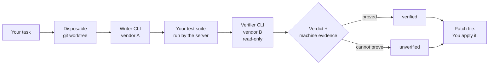

<div align="center">

# Bom Orchestration

### Two AI CLIs. One writes. The other has to prove it.

[](https://github.com/bomtobe-hgkim/bom-orch-marketplace/releases)
[](./LICENSE)
[](https://nodejs.org)
[](#install)

</div>

---

Most AI coding tools hand you a diff and a confident summary. You still have to
find out for yourself whether it works.

Bom Orchestration delegates your task to one vendor's CLI inside a disposable git
worktree, runs your repository's **own** test suite itself, hands the result to a
**different vendor** for read-only review, and grades the outcome on machine
evidence instead of prose. When it cannot prove the change works, it says
`unverified` and tells you why.

It is a local MCP server. It installs as a plugin into **Claude Code** and
**Codex**, and behaves the same in both.

## How a run actually works



The writer never grades its own work, and the verifier never gets write access.
The test run belongs to the server, not to either model — so "the tests pass" is
something we observed, not something a model told us.

## What it will not do

This section is above the install instructions on purpose. A tool whose whole
claim is *"I will not tell you it works when I cannot prove it"* should lead with
the cases where it stops.

| | |
|---|---|
| **Structured verifier, not prose** | The verifier returns structured JSON checks and issues. Callers that treated a prose approval as a pass need to be updated. |
| **`candidates: 2` roughly doubles cost** | Two lanes each author, each cross-verify, and each run their own regression evidence. Provider, writer, and test calls all roughly double. |
| **One shared deadline** | `wait_ms` bounds the whole run, not each lane. It is one shared deadline; after it passes, no new provider, test, or judge call starts. |
| **A `tie` has no patch** | When the judges disagree, both candidate patches stay on disk as recoverable artifacts and there is no representative patch. Read both and choose yourself. |
| **Untrusted tests cap the grade** | If no test command was found, or the runner cannot prove which test covers which changed file, the result stops at `unverified`. |
| **Long paths block early** | A state root deep enough to overflow the response budget ends as `blocked` before any worktree is created. Point `BOM_ORCH_HOME` at a shorter directory and call again. |
| **Patches are not applied automatically** | The result is a patch file path. You read it, then you run `git apply`. |
| **A worktree is not a sandbox** | The disposable worktree is not an OS sandbox. Worker-authored code and your repository's own test scripts run with your user privileges. Do not point this at a repository you do not trust. |

## Install

### Prerequisites

- Node.js 20.10 or newer
- `claude`, `codex`, and `git` on the host application's `PATH`
- Both worker CLIs authenticated before the first `orch_run`

### Claude Code

```powershell
$env:CLAUDE_CODE_PLUGIN_PREFER_HTTPS = '1'
claude plugin marketplace add bomtobe-hgkim/bom-orch-marketplace
claude plugin install bom-orch@bom-orch-marketplace
```

Claude's GitHub shorthand otherwise prefers SSH. That environment setting forces
HTTPS for users who do not have GitHub SSH keys. In Bash or Zsh:

```bash
CLAUDE_CODE_PLUGIN_PREFER_HTTPS=1 claude plugin marketplace add bomtobe-hgkim/bom-orch-marketplace
claude plugin install bom-orch@bom-orch-marketplace
```

### Codex

```powershell
codex plugin marketplace add bomtobe-hgkim/bom-orch-marketplace
codex plugin add bom-orch@bom-orch-marketplace
```

### Confirm it loaded

Open a new host session and check that all five `orch_*` tools are present, then
call `orch_models`. Neither step spends model tokens.

<details>
<summary><b>Pin a version, verify, upgrade, or remove</b></summary>

Pin a released tag instead of tracking `main`:

```powershell
claude plugin marketplace add bomtobe-hgkim/bom-orch-marketplace@v0.2.0 --scope user
codex plugin marketplace add bomtobe-hgkim/bom-orch-marketplace --ref v0.2.0
```

Claude Code:

```powershell
claude plugin marketplace list --json
claude plugin list --json
claude plugin details bom-orch@bom-orch-marketplace
claude mcp get plugin:bom-orch:bom-orch
claude plugin marketplace update bom-orch-marketplace
claude plugin update bom-orch@bom-orch-marketplace --scope user
claude plugin uninstall bom-orch@bom-orch-marketplace --scope user
claude plugin marketplace remove bom-orch-marketplace --scope user
```

Codex:

```powershell
codex plugin marketplace list --json
codex plugin list --json
codex mcp list --json
codex plugin marketplace upgrade bom-orch-marketplace --json
codex plugin add bom-orch@bom-orch-marketplace --json
codex plugin remove bom-orch@bom-orch-marketplace --json
codex plugin marketplace remove bom-orch-marketplace --json
```

Automation that may already configure `CLAUDE_CODE_PLUGIN_PREFER_HTTPS` should
preserve the existing value — use
`if (-not $env:CLAUDE_CODE_PLUGIN_PREFER_HTTPS) { $env:CLAUDE_CODE_PLUGIN_PREFER_HTTPS = '1' }`
in PowerShell or `: "${CLAUDE_CODE_PLUGIN_PREFER_HTTPS:=1}"` in Bash/Zsh.

</details>

## Your first run

```jsonc
// 1. Who is installed, and which models can they use?
orch_models  { "refresh": true }

// 2. Optional: pin the model and effort behind each abstract tier.
orch_config  { "vendor": "claude", "tier": "strong", "model": "opus" }

// 3. Delegate. `project` must be an absolute path to a git repository —
//    an MCP stdio server inherits its working directory from the host,
//    so a relative path lands somewhere you did not intend.
orch_run     { "task": "…what to change, concretely…",
               "project": "C:\\path\\to\\repo",
               "budget": 5 }

// 4. Read the patch, then apply it yourself:  git apply <patch.path>

// 5. Optional: correct the automatic grade so the next run learns from it.
orch_stats   { "runs": 20 }
orch_reward  { "run_id": "…", "good": false, "note": "tests passed, requirement missed" }
```

## The five tools

| Tool | What it does |
|---|---|
| `orch_run` | Delegates a task, cross-checks it with the other vendor, returns a patch file and a structured outcome |
| `orch_models` | Lists installed vendors, versions, and available model choices |
| `orch_config` | Reads or updates the model and effort behind each tier |
| `orch_stats` | Learning statistics per task class and decision axis, plus recent runs |
| `orch_reward` | Human correction of a past run's automatic grade. Idempotent |

Full argument tables and the complete result contract ship with the plugin as
skills, which both hosts read.

## It learns, and it shows its work

Every run records which decisions it made — which vendor wrote, which verified,
which tier ran — and whether the outcome held up under machine evidence. A
Bayesian bandit uses that history to pick the next run's strategy.

**The history is one store, not one per project.** Runs are bucketed by task
class — a code change in a repository that has a usable test command lands in a
different bucket from one that does not — and those buckets live in a single
`.bom-orch` directory under your profile, shared by every repository you point
`orch_run` at and by both hosts. That is the design: a strategy that works for
test-bearing code is not a fact about one checkout. Set `BOM_ORCH_HOME` to a
per-project absolute path if you would rather keep them apart.

It is deliberately conservative about what counts as evidence:

- **Success** counts only when the selected candidate is `verified`.
- **Failure** counts only on trustworthy machine evidence or an explicit policy violation.
- **Everything else abstains.** A verifier-only failure, a flaky runner, a tie, a
  deadline, or a provider outage changes nothing.

`orch_stats` shows every cell, and `orch_reward` lets you overrule the automatic
grade when it got a run wrong.

## Where your data goes

Execution stays on your machine. The repository ships readable source plus a
prebuilt, self-contained server bundle, and the host runs it locally over stdio.

Prompts and results may be sent to the selected Claude or OpenAI CLI provider
according to that provider's own configuration and terms. Learning state is
stored under the user's profile `.bom-orch` directory by default, and both hosts
share that one directory so the learning does not fork per host. Set
`BOM_ORCH_HOME` to an absolute path to move it.

**No hosted Bom Orchestration service receives prompts, results, or learning state.**

## Scope of this release

Installation is supported from this repository marketplace, verified on both CLI
hosts for GitHub `main` and for pinned release tags.

References to Desktop support mean the Codex surface in ChatGPT Desktop, and
Desktop discovery/load must be verified against each release. Providing the core
`orch_*` runtime in general ChatGPT Work would require a separate public
HTTPS MCP/app package; this local stdio release does not support that surface.

This is not a listing in an OpenAI or Anthropic official curated directory. A
skills-only directory listing would not be equivalent to the orchestration
runtime.

---

<div align="center">

**[Releases](https://github.com/bomtobe-hgkim/bom-orch-marketplace/releases)** ·
**[Changelog](./CHANGELOG.md)** ·
**[MIT License](./LICENSE)**

</div>
